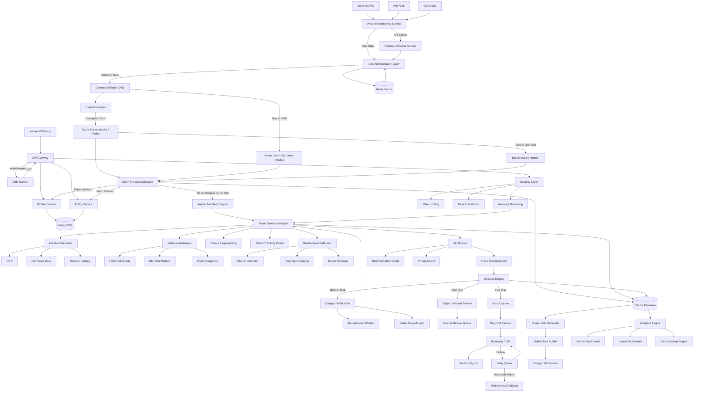
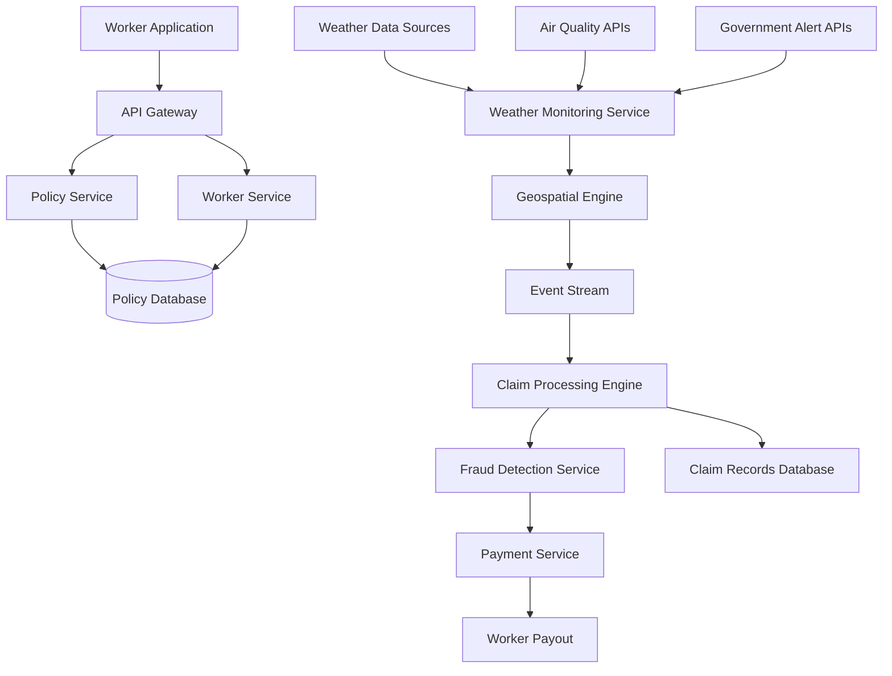
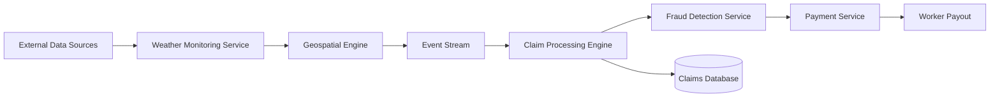
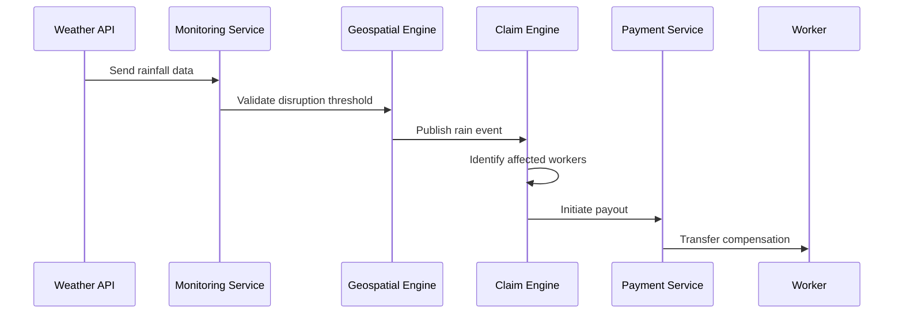
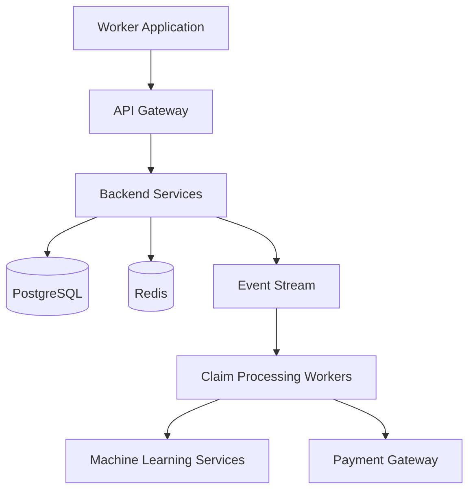

# 🚀 ALLIXIA - AI-Powered Insurance for Gig Workers

## Quick Start

### Step 1: Start Backend
```bash
cd D:\ALLIXA
run-backend.bat
```

Wait for: `Started AllixiaApplication in X.XXX seconds`

### Step 2: Verify Backend
Open browser: `http://localhost:8082/api/health`

Should see: `{"status":"UP"}`

### Step 3: Open Frontend
Double-click: `index.html`

---

## Demo Flow

1. Click **"Launch Demo Account"** on login page
2. **Dashboard** → Enter location (Lat: 19.0760, Lng: 72.8777)
3. Click **"Calculate"** → See AI premium breakdown
4. Click **"Buy Policy"** → Purchase for ₹38-43/week
5. Visit **"Policies"** → See your active policy
6. Visit **"Claims"** → Zero-touch explanation
7. Check **5 Active Triggers** on dashboard

---

## Features

✅ **Registration Process** - Full UI + JWT authentication  
✅ **Policy Management** - Create, view, track policies  
✅ **Dynamic Premium** - AI-powered pricing (₹20-100/week)  
✅ **Claims Management** - Zero-touch automation  
✅ **AI Integration** - Hyper-local risk-based pricing  
✅ **5 Automated Triggers** - NASA EONET, Weather, AQI, Traffic  
✅ **Zero-Touch UX** - No manual claims needed  

---

## Technology Stack

**Backend:**
- Spring Boot 3.2.0 + Java 17
- PostgreSQL (Neon Cloud)
- JWT Authentication + BCrypt
- AI/ML Premium Calculation
- 5 Automated Triggers

**Frontend:**
- HTML5 + CSS3 + Vanilla JS
- Responsive Design
- Real-time Premium Calculator
- Beautiful UI

**Port:** `8082` (Backend) | File (Frontend)

---

## Troubleshooting

**Backend won't start?**
```bash
# Check Java (need 17+)
java -version

# Check Maven (need 3.8+)
mvn -version

# Manual build
cd allixia-backend
mvn clean install -DskipTests
mvn spring-boot:run
```

**Frontend errors?**
- Check backend: `http://localhost:8082/api/health`
- Open browser console (F12)
- Clear browser cache

---

## Documentation

- **Quick Guide:** `START_HERE.txt`
- **Visual Guide:** `VISUAL_GUIDE.txt`

---

**ALLIXIA - Because every worker deserves protection 💪**



# 2. Problem Statement

## The Rising Gig Economy

The global gig economy has expanded rapidly over the last decade. In India alone, more than **15 million workers** participate in platform-based services such as food delivery, logistics, ride-sharing, and on-demand commerce. These workers form the operational backbone of modern digital marketplaces.

Unlike traditional employees, gig workers typically operate without:

- fixed salaries  
- employment benefits  
- health insurance or income protection  
- structured financial safety nets  

Most workers depend entirely on **daily or weekly earnings**, making them highly vulnerable to external disruptions that prevent them from working.

## Income Instability from External Disruptions

Gig workers perform most of their work outdoors. As a result, their earnings are strongly influenced by environmental and regulatory conditions.

Common disruption scenarios include:

| Event Type | Impact on Worker |
|-------------|-----------------|
| Heavy Rainfall | Delivery demand drops, riders stop working |
| Flood Alerts | Entire zones become inaccessible |
| Extreme Heat | Workers reduce operating hours |
| Severe Air Pollution | Workers avoid outdoor activity |
| Curfews or Restrictions | Platform activity temporarily stops |

When such disruptions occur, workers often lose **multiple hours or entire days of income**.

For example:

- A delivery rider in Chennai may lose **₹700–₹1200** during heavy rainfall.
- A pollution emergency in Delhi can halt outdoor work for an entire day.
- Flood conditions can disrupt operations across entire districts.

Despite the frequency of these events, **workers currently receive no compensation for lost earnings**.

## Limitations of Traditional Insurance

Conventional insurance products are poorly suited for the gig economy for several reasons:

| Limitation | Explanation |
|-------------|-------------|
| Claim-based model | Requires manual documentation and verification |
| Long settlement cycles | Payouts often take weeks or months |
| Incompatible pricing | Monthly premiums do not match gig worker income cycles |
| Administrative overhead | Claims processing increases operational cost |
| Lack of contextual triggers | Traditional insurance cannot automatically detect disruption events |

Because of these limitations, insurers rarely offer products designed specifically for **short-term income loss caused by environmental disruptions**.


## The Insurance Gap

This situation creates a significant protection gap.

Gig workers face:

- frequent income volatility  
- limited savings buffers  
- lack of accessible financial protection tools  

At the same time, insurers struggle to design products that are:

- scalable  
- low-cost  
- fraud-resistant  
- automated

# 3. Solution Overview

## 3.1 Concept of Parametric Income Protection

ALLIXA introduces a **parametric insurance model** designed specifically for gig economy workers. Unlike traditional insurance, parametric insurance does not rely on manual claims or post-event verification. Instead, payouts are triggered automatically when predefined environmental conditions are met.

These conditions are measured using trusted external data sources such as:

- weather monitoring services
- air quality monitoring networks
- government disaster alerts
- geospatial event detection systems

When a disruption exceeds predefined thresholds within a worker’s operational zone, the platform automatically calculates the expected income loss and initiates compensation.

This approach enables:

- instant claim processing  
- minimal administrative overhead  
- transparent payout logic  
- scalable operations across large worker populations  


## 3.2 ALLIXA Platform Overview

ALLIXA operates as a **distributed, event-driven risk protection platform** designed to monitor environmental disruptions and protect gig workers from income instability.

The system continuously observes external data sources and maps them to geographic work zones using geospatial indexing. When a disruption event occurs within a worker's operational zone, the system automatically evaluates eligibility and generates payouts.

At a high level, the platform performs the following functions:

1. **Worker Enrollment and Policy Creation**

   Workers register through the platform and their operating location is mapped into geospatial zones. Based on this information, the system generates an insurance policy tailored to the worker’s environment and activity patterns.

2. **Continuous Environmental Monitoring**

   The system continuously collects external signals such as rainfall intensity, temperature alerts, air quality indexes, and government emergency notices.

3. **Disruption Detection**

   Environmental signals are analyzed against predefined thresholds to determine whether a disruption event has occurred.

4. **Automated Claim Processing**

   When an event affects a geographic zone, the platform identifies all workers operating within that zone and automatically evaluates policy eligibility.

5. **Fraud Validation and Payment Processing**

   Fraud detection systems validate each claim before initiating payouts through integrated payment systems.


## 3.3 Core Design Principles

ALLIXA is built around several architectural principles that enable the system to scale efficiently while maintaining transparency and operational efficiency.

### Automation First

The platform eliminates manual claim processes by relying on objective external signals. This allows claims to be processed without worker intervention.

### Event-Driven Architecture

Rather than continuously checking worker conditions, the system responds to **real-world events** such as rainfall spikes or air quality alerts. This significantly reduces computational overhead.

### Geospatial Intelligence

Workers and disruption events are mapped to **high-resolution geographic zones**, enabling accurate detection of localized disruptions.

### Predictive Risk Intelligence

Machine learning models analyze historical weather patterns, claim data, and environmental signals to predict disruption risks and adjust insurance pricing dynamically.

### Transparency and Auditability

All claim decisions are recorded and verifiable through a transparent audit layer, ensuring that workers and insurers can trace how payouts were determined.


# 4. Key Innovations

## 4.1 Automated Parametric Claim Processing

Traditional insurance relies on a manual claims process that requires documentation, verification, and approval. This process can take days or weeks.

ALLIXA replaces this model with **parametric triggers** that automatically activate payouts when disruption thresholds are detected.

Example trigger logic:
```
IF rainfall_intensity > threshold
AND worker_zone == disruption_zone
THEN initiate payout
```

This eliminates the need for:

- claim submission forms  
- manual inspections  
- human adjudication  

The result is a significantly faster and more reliable payout system.


## 4.2 Predictive Risk Intelligence

ALLIXA incorporates predictive analytics to estimate disruption risk before events occur.

The system analyzes:

- historical weather data
- geographic flood risk
- seasonal climate patterns
- claim history
- worker activity levels

These inputs generate **risk scores for geographic zones**, allowing the platform to predict potential disruptions and prepare insurers for upcoming claims.

Risk predictions are visualized through dynamic geospatial heatmaps, helping insurers and platform operators monitor potential exposure.

## 4.3 Machine Learning–Driven Premium Pricing

Traditional insurance pricing relies on static risk categories that rarely adapt to dynamic environmental conditions.

ALLIXA uses machine learning models to dynamically determine insurance premiums based on:

- geographic disruption risk
- seasonal weather trends
- worker activity patterns
- historical claim frequency

This allows the system to generate **fair and adaptive pricing** that reflects real environmental conditions.


## 4.4 Event-Driven Distributed Architecture

The system is built using an event-driven architecture that processes environmental disruptions as real-time events.

Instead of repeatedly checking worker status, the platform reacts to signals generated by disruption events.

This approach provides several advantages:

- improved scalability  
- reduced computational overhead  
- faster claim processing  
- better fault tolerance  

The architecture allows ALLIXA to scale to **millions of workers across thousands of geographic zones** without excessive infrastructure cost.


## 4.5 Transparent Claim Verification

Insurance systems often face trust issues because users cannot verify how claims are evaluated.

ALLIXA addresses this through a **transparent claim verification system**.

Each payout includes verifiable information such as:

- disruption event type  
- geographic zone affected  
- external data source used  
- payout calculation  

This transparency ensures that workers, insurers, and regulators can independently verify claim decisions.

## 4.6 Fraud-Resilient Claim Architecture

ALLIXA is designed to operate in adversarial environments where malicious actors may attempt to exploit automated insurance systems.

Unlike traditional parametric platforms that rely heavily on single-source validation (e.g., GPS), ALLIXA incorporates a **multi-signal fraud detection architecture** that evaluates claims using multiple independent data sources.

### Multi-Signal Validation

Each claim is validated using a combination of:

- location verification (GPS + network signals)  
- worker activity patterns  
- platform interaction signals  
- device integrity checks  

This ensures that no single manipulated signal can trigger a payout.


### Behavioral Intelligence

The system analyzes worker behavior over time, including:

- historical activity patterns  
- delivery frequency  
- idle time anomalies  

Claims that deviate significantly from expected behavior are flagged for further validation.


### Coordinated Fraud Detection

ALLIXA incorporates **graph-based fraud detection** to identify coordinated attacks.

Instead of evaluating users individually, the system detects:

- clusters of users with identical behavior  
- synchronized claim submissions  
- shared device or network patterns  

This enables detection of large-scale fraud rings attempting to exploit disruption events.

### Location Trust Scoring

Rather than trusting raw GPS data, ALLIXA computes a **location trust score** using:

- GPS consistency  
- network validation (cell tower data)  
- motion signals  

Only claims with sufficient trust scores are eligible for automated payouts.

### Outcome

This architecture transforms ALLIXA from a basic parametric system into a:

**fraud-resilient, adversarially robust insurance platform capable of operating at national scale**

# 5. Target Users

## 5.1 Primary User Segment – Gig Economy Workers

ALLIXA is designed primarily for workers participating in the **on-demand digital economy**. These workers depend on short-cycle earnings and are highly exposed to environmental disruptions that prevent them from working.

The platform focuses on workers whose income is directly tied to **physical mobility and outdoor activity**.

Examples include:

- food delivery partners  
- grocery and quick commerce riders  
- last-mile logistics couriers  
- ride-hailing drivers  
- independent service providers working outdoors  

Because these workers rely on **daily operational activity**, even short disruptions can lead to immediate income loss.


## 5.2 Representative User Persona

To illustrate how ALLIXA serves gig workers, consider the following representative persona.

| Attribute | Example Profile |
|----------|----------------|
| Name | Rajan |
| Age | 28 |
| Location | Chennai |
| Occupation | Food delivery partner |
| Platform | Swiggy / Zomato |
| Average weekly income | ₹4,500 – ₹5,500 |
| Work pattern | 10–12 hours/day, 6 days/week |

### Key Challenges Faced by Workers

| Challenge | Impact |
|-----------|--------|
| Weather disruptions | Reduced deliveries and earnings |
| Air pollution | Reduced working hours |
| Flood alerts | Entire zones shut down |
| Curfews or restrictions | Platform activity stops |

In these situations, workers typically receive **no compensation for lost time**, even though the disruption is outside their control.

ALLIXA aims to protect workers like Rajan by providing **automated income protection when disruption events occur**.

## 5.3 Secondary Stakeholders

While gig workers are the primary beneficiaries, several additional stakeholders interact with the platform.

| Stakeholder | Role |
|-------------|------|
| Insurance providers | Underwrite parametric coverage policies |
| Gig platforms | Potential integration partners |
| Regulators | Oversee insurance compliance |
| Financial institutions | Provide payment and settlement infrastructure |

By creating a transparent and scalable infrastructure for parametric insurance, ALLIXA enables these stakeholders to participate in a **shared risk protection ecosystem**.

# 6. System Architecture

## 6.1 High-Level Architecture

ALLIXA is designed as a **distributed event-driven platform** that continuously monitors environmental signals, detects disruption events, and automatically processes claims.

The system is composed of several cooperating subsystems:

- worker applications
- API gateway
- policy management services
- environmental monitoring services
- event streaming infrastructure
- claim processing engines
- fraud detection systems
- payment services
- analytics dashboards

These components interact through asynchronous event streams, enabling the platform to scale across large geographic regions.

### High-Level Architecture Diagram



## 6.2 Architectural Design Principles

The system architecture is guided by several key principles that enable ALLIXA to operate efficiently at large scale while maintaining reliability and transparency.

### Event-Driven Processing

Environmental disruptions are treated as **system events**. When a disruption occurs, it is published to an event stream that triggers downstream processing components.

This approach allows the system to process events efficiently without continuously polling worker data. Instead of repeatedly checking conditions, services react only when meaningful events occur.

Benefits include:

- reduced infrastructure overhead  
- faster event response time  
- improved scalability under high event volumes  


### Geospatial Partitioning

The platform uses **geospatial indexing** to divide geographic regions into small, manageable grid cells.

Workers and environmental signals are mapped to these cells to identify affected zones quickly. When a disruption occurs in a specific cell, the system can instantly identify all workers operating within that area.

This enables:

- accurate disruption detection  
- localized event processing  
- efficient worker-to-event matching  


### Horizontal Scalability

ALLIXA is designed so that each subsystem can scale independently.

Processing services such as claim evaluation, fraud detection, and event processing operate through distributed worker nodes connected via event queues. As system load increases, additional workers can be added to handle higher event throughput.

This architecture allows the platform to support:

- millions of workers  
- thousands of disruption events  
- high transaction volumes  

without degrading performance.


### Fault Isolation

Subsystems communicate through **asynchronous event streams** rather than direct service dependencies.

If one component experiences failure, other services remain operational because they process events independently. This prevents failures from cascading across the entire system.

Fault isolation improves:

- system resilience  
- operational stability  
- recovery from service interruptions  

# 7. Core Platform Components

The ALLIXA platform is composed of several major system components, each responsible for a distinct function within the platform.

| Component | Responsibility |
|----------|----------------|
| Worker Application | Provides the user interface for worker registration, policy enrollment, and claim visibility |
| API Gateway | Handles authentication, request routing, and access control |
| Policy Service | Manages insurance policies, coverage tiers, and premium calculations |
| Worker Service | Stores worker profiles, operational zones, and activity metadata |
| Geospatial Engine | Maps worker locations and environmental signals to geographic grid cells |
| Weather Monitoring Service | Continuously retrieves environmental data from external sources |
| Event Stream Infrastructure | Distributes disruption events across processing components |
| Claim Processing Engine | Evaluates disruption events and generates automated claims |
| Fraud Detection Service | Detects suspicious claims using rule-based and machine learning models |
| Payment Service | Initiates and manages worker payout transactions |
| Claim Records Database | Stores historical claim data for auditing and analytics |
| Analytics Dashboard | Provides operational insights for insurers and administrators |
| Transparency Explorer | Allows workers and regulators to verify claim decisions |

# 8. Data Flow

ALLIXA processes disruption events through an **event-driven pipeline** that transforms external environmental signals into automated insurance payouts.  
The system reacts to real-world disruption events rather than continuously polling worker activity, which allows the platform to scale efficiently across large geographic regions.


## 8.1 Data Flow Overview

The following diagram illustrates how external data moves through the platform and eventually results in automated worker payouts.


## 8.2 Workflow Steps

| Step | Description |
|-----|-------------|
| Data Collection | Environmental APIs provide weather, air quality, and disaster alert signals |
| Event Detection | Environmental thresholds are evaluated to determine disruption events |
| Zone Mapping | Events are mapped to geospatial grid cells using the geospatial engine |
| Worker Matching | Workers operating within the affected geospatial cells are identified |
| Claim Processing | Automated claims are generated for all eligible workers in the disruption zone |
| Fraud Validation | Fraud detection models and rule checks evaluate claim legitimacy |
| Payment Execution | Verified claims trigger automated payouts through the payment gateway |


## 8.3 Event Trigger Example

The sequence below demonstrates how a disruption signal (such as heavy rainfall) flows through the system and results in an automated payout.




This gap presents an opportunity for **parametric insurance systems** that rely on objective external triggers instead of manual claims.

# 9. Technology Stack

ALLIXA is implemented using a **scalable, modular technology stack** designed for distributed event-driven systems.  
The architecture prioritizes **reliability, scalability, and low operational overhead**, enabling the platform to support large worker populations across geographically distributed zones.

## 9.1 Core Technology Stack

| Layer | Technology |
|------|-------------|
| Frontend | React, TypeScript, Progressive Web App |
| Backend | Node.js, Express |
| Database | PostgreSQL |
| Cache Layer | Redis |
| Event Processing | Kafka / Redis Streams |
| Machine Learning | Python, scikit-learn |
| Geospatial Indexing | H3 |
| Payments | Razorpay / UPI |
| Blockchain Audit | Polygon |
| Infrastructure | Docker, Cloud Hosting |


## 9.2 Infrastructure Overview

The platform infrastructure is designed to separate **API services, event processing, machine learning workloads, and payment systems** to allow independent scaling.




ALLIXA addresses this gap by introducing a **data-driven, automated income protection platform** built specifically for the operational patterns of the gig economy.

## 9.3 Technology Responsibilities

| Technology | Role |
|------------|------|
| H3 | Converts worker GPS coordinates into geospatial grid cells for localized disruption detection |
| Redis | Provides caching for frequently accessed data and temporary event buffering |
| Kafka / Redis Streams | Distributes disruption events across system services through event-driven messaging |
| PostgreSQL | Stores persistent data including worker profiles, policies, and claim records |
| Node.js | Implements backend APIs, orchestration logic, and service coordination |
| Python (scikit-learn) | Executes machine learning models for pricing, fraud detection, and risk prediction |
| Razorpay / UPI | Handles payout transactions to workers |
| Docker | Provides containerized deployment for scalable service infrastructure |


# 10. Machine Learning and Intelligence Layer

Machine learning enables ALLIXA to improve **risk prediction, pricing accuracy, and fraud detection** by continuously learning from operational data. Instead of relying entirely on static rules, the system uses predictive models to analyze historical disruptions, worker activity patterns, and environmental signals.

This intelligence layer allows the platform to dynamically adapt to changing risk conditions across geographic zones.


## 10.1 Machine Learning Components

| Model | Purpose |
|------|---------|
| Premium Pricing Model | Dynamically estimates insurance premiums based on geographic and seasonal risk factors |
| Fraud Detection Model | Detects anomalous claim patterns and suspicious activity |
| Risk Prediction Model | Forecasts disruption probability in specific geographic zones |
| Worker Activity Model | Identifies peak earning windows for adaptive coverage optimization |


## 10.2 ML Data Pipeline

The machine learning pipeline aggregates data from multiple operational sources and transforms it into features used to train predictive models.

| Data Source | Description |
|-------------|-------------|
| Weather Data | Real-time and historical environmental signals |
| Historical Claims | Past claim patterns used to identify disruption trends |
| Worker Activity Data | Worker operating hours and geographic mobility patterns |

The processed features are used to train and update multiple models that influence pricing, risk prediction, and fraud detection.


## 10.3 Risk Intelligence Engine

The predictive engine evaluates disruption probability for each geographic zone by analyzing environmental signals and historical event patterns.

### Input Signals

| Input Signal | Purpose |
|--------------|---------|
| Weather Forecast | Estimates likelihood of rainfall or extreme weather |
| Seasonal Data | Captures climate cycles such as monsoon patterns |
| Zone Risk Index | Identifies historically flood-prone areas |
| Claim Density | Measures historical disruption frequency |

### Output Signals

| Output | Description |
|-------|-------------|
| Risk Score | Probability of disruption within a specific geographic zone |
| Risk Zone | Geographic region predicted to experience disruption |
| Expected Claims | Estimated number of potential payouts |

These predictions allow the platform to anticipate disruption risk and adjust operational parameters such as pricing and insurer exposure monitoring.

## 10.4 Advanced Fraud Intelligence Models

ALLIXA extends traditional fraud detection by incorporating multiple machine learning techniques designed to operate in adversarial environments.

Rather than relying on a single anomaly detection model, the platform uses a combination of behavioral modeling and graph-based analysis to detect both individual and coordinated fraud attempts.

### Behavioral Anomaly Detection

The system continuously learns normal worker behavior patterns and identifies deviations using anomaly detection models.

Key behavioral features include:

- average working hours  
- delivery frequency  
- idle time distribution  
- claim frequency patterns  

These features are used to detect:

- sudden inactivity during peak hours  
- abnormal claim timing  
- inconsistent work behavior  

### Graph-Based Fraud Detection

To detect coordinated fraud rings, ALLIXA models worker relationships as a graph structure.

| Element | Description |
|--------|------------|
| Nodes | Individual workers |
| Edges | Similarity in location, timing, device, or claim patterns |

Fraud clusters are identified when multiple workers exhibit:

- synchronized claim submissions  
- identical location patterns  
- similar device or network signatures  

This allows the system to detect fraud that appears “normal” at an individual level but is suspicious at a group level.

### Multi-Signal Fraud Scoring

Fraud detection is based on a composite scoring system:

| Signal Category | Examples |
|----------------|----------|
| Location Signals | GPS consistency, cell tower validation |
| Behavioral Signals | work patterns, inactivity anomalies |
| Platform Signals | delivery activity, order acceptance |
| Device Signals | fingerprint consistency, emulator detection |

Each signal contributes to a unified **fraud risk score**, which determines claim handling.

### Decision Integration

The output of fraud models directly influences:

- claim approval or rejection  
- delayed verification workflows  
- manual review triggers  

This ensures that fraud detection is not isolated, but fully integrated into the claim processing pipeline.

### Outcome

By combining behavioral, statistical, and graph-based models, ALLIXA achieves:

- higher fraud detection accuracy  
- resistance to coordinated attacks  
- reduced false positives for genuine users  

This transforms the ML layer into a **core defense system rather than just a supporting component**.

# 11. Scalability, Reliability, and Security

ALLIXA is designed as a **large-scale distributed system** capable of supporting millions of workers across geographically distributed zones. The architecture prioritizes horizontal scalability, fault tolerance, and strong security guarantees to ensure that disruption detection and payouts remain reliable even under high event loads.

## 11.1 Scalability Strategy

The platform achieves scalability through **geospatial partitioning and event-driven processing**.

Instead of processing events individually for each worker, the system groups workers into **geographic grid cells**. When a disruption occurs in a specific cell, the platform processes the event once and applies the outcome to all workers operating within that cell.

| Strategy | Description |
|----------|-------------|
| Geospatial Partitioning | Workers and environmental signals are mapped to grid cells for localized processing |
| Event Streaming | Disruption events are distributed through an event bus |
| Horizontal Workers | Claim processing workers can scale dynamically based on event volume |
| Batch Processing | Multiple worker claims are generated in a single processing cycle |

This approach allows the platform to efficiently process disruption events affecting **thousands of workers simultaneously**.


## 11.2 Reliability and Fault Tolerance

To maintain operational stability, ALLIXA separates system responsibilities across independent services. These services communicate through asynchronous event streams rather than tightly coupled service calls.

| Reliability Mechanism | Purpose |
|-----------------------|---------|
| Event Queue Buffering | Prevents system overload during disruption spikes |
| Service Isolation | Limits failure propagation between subsystems |
| Retry Mechanisms | Automatically retries failed claim processing tasks |
| Redundant Data Sources | Multiple weather data providers improve reliability |

This design ensures that temporary service failures do not disrupt the entire payout pipeline.


## 11.3 Security and Fraud Prevention

ALLIXA implements a **multi-layered fraud prevention architecture** designed to operate in adversarial environments where attackers may attempt coordinated exploitation.

Unlike traditional systems that rely on single-point validation (e.g., GPS), ALLIXA uses **multi-signal verification, behavioral intelligence, and graph-based detection** to ensure claim integrity.


### Multi-Signal Claim Validation

Every claim is evaluated using multiple independent signals rather than relying solely on location data.

| Signal Type | Validation Purpose |
|------------|-------------------|
| Location Signals | GPS consistency and geospatial accuracy |
| Network Signals | Cell tower triangulation and latency patterns |
| Behavioral Signals | Worker activity and historical patterns |
| Platform Signals | Delivery activity and engagement metrics |
| Device Signals | Device fingerprint and emulator detection |

A claim is only approved when all signals meet predefined trust thresholds.


### Behavioral Fraud Detection

The system continuously analyzes worker behavior over time to identify anomalies.

| Behavior Indicator | Fraud Signal |
|------------------|-------------|
| Sudden inactivity during peak hours | Suspicious behavior |
| No delivery history during event | Possible spoofing |
| Abnormal claim frequency | High fraud risk |
| Static location for extended duration | Likely GPS manipulation |

This ensures that claims align with realistic worker activity patterns.


### Coordinated Fraud Detection

ALLIXA includes **graph-based fraud detection** to identify organized fraud rings.

Instead of evaluating users individually, the system detects:

- clusters of workers with identical location patterns  
- synchronized claim submissions  
- shared device or network signatures  

If a cluster exhibits high similarity across multiple signals, it is flagged as a coordinated fraud attempt.


### Location Trust Scoring

Rather than trusting raw GPS data, ALLIXA computes a **Location Trust Score** using multiple inputs.

| Component | Purpose |
|----------|--------|
| GPS Consistency | Verifies stable location data |
| Cell Tower Match | Confirms network-level location |
| Motion Validation | Detects real-world movement |

Only claims with sufficient trust scores are eligible for automated payouts.


### Tiered Claim Decision System

To balance fraud prevention with user fairness, ALLIXA uses a tiered decision model.

| Risk Level | Action |
|-----------|--------|
| Low Risk | Instant payout |
| Medium Risk | Delayed verification |
| High Risk | Manual review or rejection |

This ensures that suspicious claims are investigated without delaying legitimate payouts unnecessarily.


### System Integrity Outcome

This multi-layered approach ensures that:

- spoofed GPS signals cannot independently trigger payouts  
- coordinated fraud attacks are detected at scale  
- genuine workers are not penalized due to network inconsistencies  

ALLIXA’s fraud prevention system transforms the platform into a **resilient, production-grade insurance infrastructure capable of operating under adversarial conditions**.


## 11.4 Data Security

ALLIXA protects sensitive worker and financial data using standard security practices.

| Security Practice | Purpose |
|-------------------|---------|
| Encrypted Data Storage | Protects sensitive worker information |
| Secure API Authentication | Prevents unauthorized access |
| Role-Based Access Control | Limits system access based on user roles |
| Audit Logging | Tracks all claim and payout activities |

These mechanisms ensure compliance with modern data protection standards while maintaining system transparency.

# 12. Adversarial Defense & Anti-Spoofing Strategy

ALLIXA is designed to operate in adversarial environments where coordinated fraud attempts can exploit parametric insurance systems. This section outlines the platform’s defense mechanisms against **GPS spoofing, coordinated fraud rings, and behavioral manipulation attacks**, ensuring system integrity without compromising user experience.


## 12.1 Threat Model

The platform assumes the presence of sophisticated fraud actors capable of:

* **Spoofing GPS location** using mobile applications or emulators.
* **Coordinating attacks** through messaging platforms (e.g., Telegram groups).
* **Simulating inactivity** to appear affected by disruption events.
* **Generating large volumes** of synchronized claims.

### Example Attack Scenario

| Attack Vector | Description |
| :--- | :--- |
| **GPS Spoofing** | Workers fake their location inside a disruption zone using software tools. |
| **Coordinated Claims** | Multiple users trigger claims simultaneously to overwhelm the system. |
| **Behavioral Mimicry** | Fraudsters simulate inactivity patterns to mimic legitimate disruption. |
| **Device Manipulation** | Use of emulators, rooted devices, or cloned app environments. |


## 12.2 Multi-Signal Validation Architecture

ALLIXA replaces single-point GPS validation with a **multi-signal verification system**. A claim is only approved when the combined signals meet predefined trust thresholds.

### Claim Validation Logic

The system calculates validity based on the following weighted inputs:
* **Location Signal:** Raw GPS and network data.
* **Behavioral Signal:** Historical vs. real-time activity matching.
* **Platform Activity Signal:** Active status on the gig economy app.
* **Device Integrity Signal:** Hardware attestation and environment checks.

## 12.3 Data Signals Beyond GPS

To detect spoofing and validate real-world activity, the system analyzes multiple independent signals:

| Signal | Purpose |
| :--- | :--- |
| **GPS Coordinates** | Base location reference. |
| **Cell Tower Triangulation** | Detect mismatch with spoofed GPS coordinates. |
| **Network Latency Patterns** | Identify emulator, VPN, or proxy environments. |
| **Accelerometer / Motion** | Validate physical real-world movement. |
| **App Foreground Activity** | Confirm worker engagement with the platform. |
| **Historical Work Patterns** | Detect abnormal inactivity compared to user norms. |
| **Device Fingerprint** | Identify duplicate accounts or cloned devices. |


## 12.4 Behavioral and Temporal Analysis

ALLIXA evaluates worker behavior over time to detect anomalies that suggest fraud:

| Behavior Signal | Fraud Indicator | Risk Level |
| :--- | :--- | :--- |
| **Sudden Inactivity** | Inactivity during peak hours without external cause. | Suspicious |
| **No Delivery History** | Claiming disruption with no active orders prior to event. | Suspicious |
| **Static Location** | Perfectly still GPS coordinates over long periods. | Possible Spoofing |
| **Claim Frequency** | Multiple claims in a short temporal window. | High Fraud Risk |


## 12.5 Group Fraud Detection (Coordinated Attacks)

ALLIXA incorporates **graph-based fraud detection** to identify coordinated fraud rings. 

* **Concept:** Each worker is represented as a node in a graph.
* **Connections:** Links are formed based on similarity in location, timing, device characteristics, and claim patterns.
* **Detection:** If a cluster of nodes triggers claims simultaneously with identical device signatures, the system classifies it as a **Coordinated Fraud Cluster**.

### Cluster Detection Signals
* **High-Density Claim Clusters:** Detect mass fraud events in specific zones.
* **Identical Timestamps:** Identify synchronized attacks.
* **Shared Device Signatures:** Detect the use of the same emulator profiles across accounts.

## 12.6 Location Trust Scoring

The system evaluates the reliability of a worker’s reported location using a composite score:

$$Location Trust Score = GPS_{Consistency} + Cell_{Match} + Motion_{Validation}$$

| Trust Score | Action |
| :--- | :--- |
| **High** | Accept location as valid; proceed to payout. |
| **Medium** | Require additional verification (e.g., photo or app ping). |
| **Low** | Flag as suspicious; block automated payout. |


## 12.7 Tiered Claim Decision System

To balance fraud prevention with user fairness, ALLIXA uses a tiered approach:

1.  **Low Risk:** Instant payout processed via smart contract.
2.  **Medium Risk:** Delayed verification; requires secondary data check.
3.  **High Risk:** Manual review by system administrators or automatic rejection.


## 12.8 Worker Experience and UX Balance

ALLIXA ensures that fraud detection does not negatively impact genuine users. The system follows these UX principles:
* Avoid direct fraud accusations.
* Provide clear, neutral status updates.
* Minimize payout delays for users with high historical trust scores.

> **Example User Message:** *"Your claim is under verification due to temporary network inconsistencies. This process will complete shortly."*


## 12.9 Fail-Safe and Fallback Mechanisms

In cases where data confidence is low (e.g., widespread network outages), the system applies fallback strategies:
* **Weak Signal Confidence:** Partial payout or delayed processing until signal stabilizes.
* **Temporary Data Loss:** Queue validation for retry after a short interval.
* **Ambiguous Fraud Score:** Escalate for human-in-the-loop manual review.


## 12.10 Summary

The adversarial defense layer transforms ALLIXA into a fraud-resilient parametric insurance platform. By combining multi-signal validation, graph-based detection, and trust scoring, ALLIXA ensures:
* **Fraudulent claims** are blocked at scale.
* **Coordinated attacks** are detected before liquidity is drained.
* **Genuine workers** receive fair, automated, and timely payouts.

# 13. Conclusion

ALLIXA proposes a scalable, data-driven approach to protecting gig workers from income instability caused by environmental disruptions. By combining **parametric insurance principles with modern distributed system design**, the platform eliminates the delays and inefficiencies associated with traditional insurance claims.

The system continuously monitors environmental signals, detects disruption events, and automatically compensates affected workers through a transparent and auditable process.

Key capabilities of the platform include:

- automated disruption detection using external data sources  
- geospatial mapping of workers and events for precise coverage  
- event-driven claim processing for large-scale operations  
- machine learning models for risk prediction and fraud detection  
- transparent claim verification and payout tracking  

Together, these components form a **scalable infrastructure for gig economy income protection**.

As gig-based employment continues to expand globally, platforms like ALLIXA can provide the financial stability needed for workers to operate confidently despite unpredictable environmental conditions. By bridging the gap between insurance systems and real-time data infrastructure, ALLIXA demonstrates how modern technology can enable **accessible, automated protection for the future workforce**.
