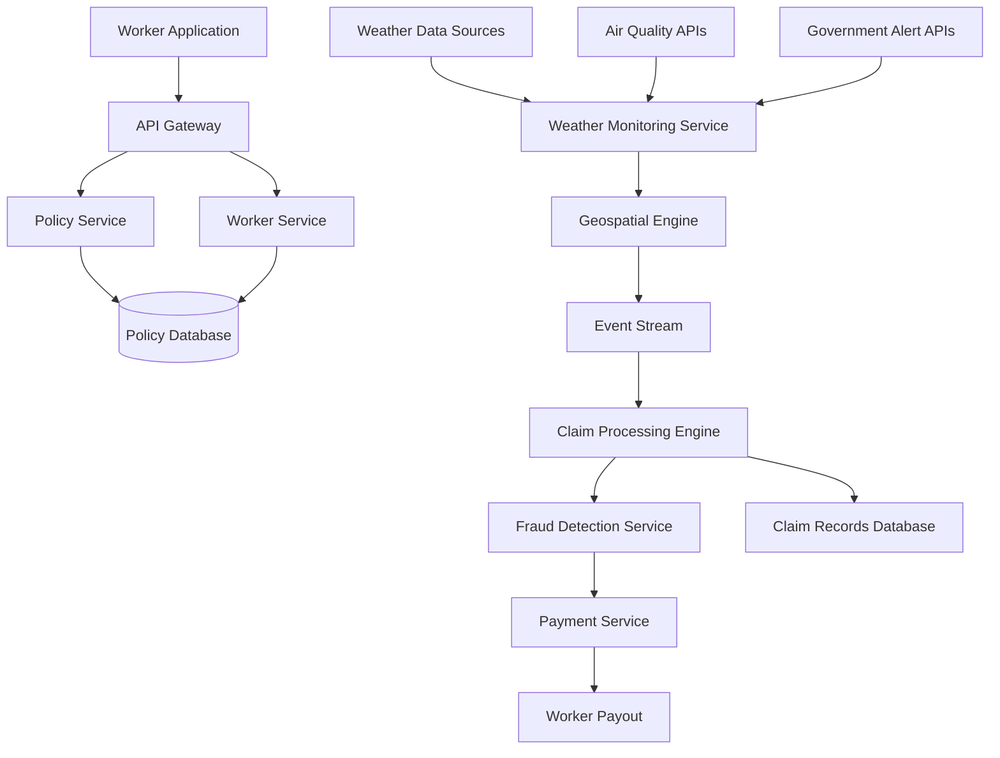
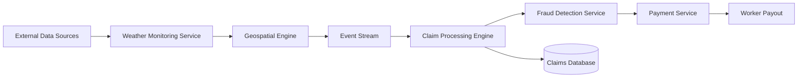
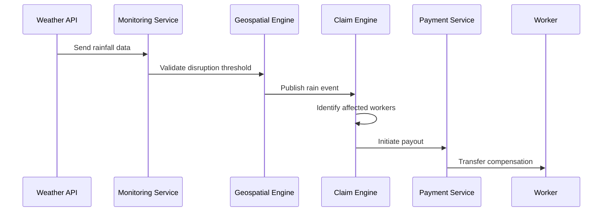
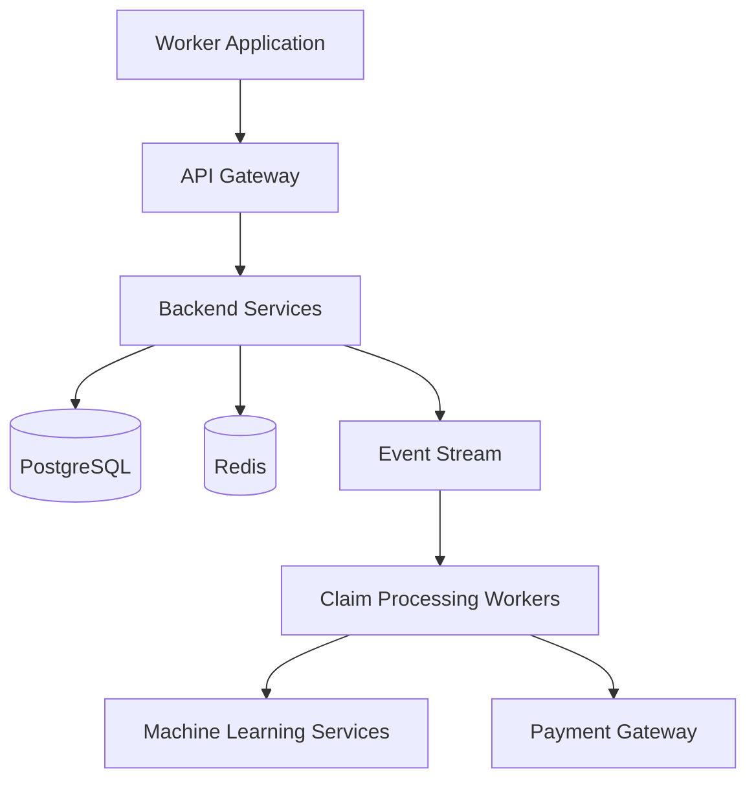

# GigShield

**GigShield** is an AI-powered parametric insurance platform designed to protect gig economy workers from income loss caused by external disruptions such as extreme weather, pollution alerts, and government-imposed restrictions.

The system automatically detects disruption events, evaluates their impact on worker earnings, and triggers transparent payouts without requiring manual claims. By combining geospatial intelligence, event-driven architecture, machine learning models, and transparent audit systems, GigShield enables scalable income protection for millions of gig workers.


# Problem Statement

## The Rising Gig Economy

The global gig economy has expanded rapidly over the last decade. In India alone, more than **15 million workers** participate in platform-based services such as food delivery, logistics, ride-sharing, and on-demand commerce. These workers form the operational backbone of modern digital marketplaces.

Unlike traditional employees, gig workers typically operate without:

- fixed salaries  
- employment benefits  
- health insurance or income protection  
- structured financial safety nets  

Most workers depend entirely on **daily or weekly earnings**, making them highly vulnerable to external disruptions that prevent them from working.

## Income Instability from External Disruptions

Gig workers perform most of their work outdoors. As a result, their earnings are strongly influenced by environmental and regulatory conditions.

Common disruption scenarios include:

| Event Type | Impact on Worker |
|-------------|-----------------|
| Heavy Rainfall | Delivery demand drops, riders stop working |
| Flood Alerts | Entire zones become inaccessible |
| Extreme Heat | Workers reduce operating hours |
| Severe Air Pollution | Workers avoid outdoor activity |
| Curfews or Restrictions | Platform activity temporarily stops |

When such disruptions occur, workers often lose **multiple hours or entire days of income**.

For example:

- A delivery rider in Chennai may lose **₹700–₹1200** during heavy rainfall.
- A pollution emergency in Delhi can halt outdoor work for an entire day.
- Flood conditions can disrupt operations across entire districts.

Despite the frequency of these events, **workers currently receive no compensation for lost earnings**.

## Limitations of Traditional Insurance

Conventional insurance products are poorly suited for the gig economy for several reasons:

| Limitation | Explanation |
|-------------|-------------|
| Claim-based model | Requires manual documentation and verification |
| Long settlement cycles | Payouts often take weeks or months |
| Incompatible pricing | Monthly premiums do not match gig worker income cycles |
| Administrative overhead | Claims processing increases operational cost |
| Lack of contextual triggers | Traditional insurance cannot automatically detect disruption events |

Because of these limitations, insurers rarely offer products designed specifically for **short-term income loss caused by environmental disruptions**.


## The Insurance Gap

This situation creates a significant protection gap.

Gig workers face:

- frequent income volatility  
- limited savings buffers  
- lack of accessible financial protection tools  

At the same time, insurers struggle to design products that are:

- scalable  
- low-cost  
- fraud-resistant  
- automated

- # 3. Solution Overview

## 3.1 Concept of Parametric Income Protection

GigShield introduces a **parametric insurance model** designed specifically for gig economy workers. Unlike traditional insurance, parametric insurance does not rely on manual claims or post-event verification. Instead, payouts are triggered automatically when predefined environmental conditions are met.

These conditions are measured using trusted external data sources such as:

- weather monitoring services
- air quality monitoring networks
- government disaster alerts
- geospatial event detection systems

When a disruption exceeds predefined thresholds within a worker’s operational zone, the platform automatically calculates the expected income loss and initiates compensation.

This approach enables:

- instant claim processing  
- minimal administrative overhead  
- transparent payout logic  
- scalable operations across large worker populations  


## 3.2 GigShield Platform Overview

GigShield operates as a **distributed, event-driven risk protection platform** designed to monitor environmental disruptions and protect gig workers from income instability.

The system continuously observes external data sources and maps them to geographic work zones using geospatial indexing. When a disruption event occurs within a worker's operational zone, the system automatically evaluates eligibility and generates payouts.

At a high level, the platform performs the following functions:

1. **Worker Enrollment and Policy Creation**

   Workers register through the platform and their operating location is mapped into geospatial zones. Based on this information, the system generates an insurance policy tailored to the worker’s environment and activity patterns.

2. **Continuous Environmental Monitoring**

   The system continuously collects external signals such as rainfall intensity, temperature alerts, air quality indexes, and government emergency notices.

3. **Disruption Detection**

   Environmental signals are analyzed against predefined thresholds to determine whether a disruption event has occurred.

4. **Automated Claim Processing**

   When an event affects a geographic zone, the platform identifies all workers operating within that zone and automatically evaluates policy eligibility.

5. **Fraud Validation and Payment Processing**

   Fraud detection systems validate each claim before initiating payouts through integrated payment systems.


## 3.3 Core Design Principles

GigShield is built around several architectural principles that enable the system to scale efficiently while maintaining transparency and operational efficiency.

### Automation First

The platform eliminates manual claim processes by relying on objective external signals. This allows claims to be processed without worker intervention.

### Event-Driven Architecture

Rather than continuously checking worker conditions, the system responds to **real-world events** such as rainfall spikes or air quality alerts. This significantly reduces computational overhead.

### Geospatial Intelligence

Workers and disruption events are mapped to **high-resolution geographic zones**, enabling accurate detection of localized disruptions.

### Predictive Risk Intelligence

Machine learning models analyze historical weather patterns, claim data, and environmental signals to predict disruption risks and adjust insurance pricing dynamically.

### Transparency and Auditability

All claim decisions are recorded and verifiable through a transparent audit layer, ensuring that workers and insurers can trace how payouts were determined.


# 4. Key Innovations

## 4.1 Automated Parametric Claim Processing

Traditional insurance relies on a manual claims process that requires documentation, verification, and approval. This process can take days or weeks.

GigShield replaces this model with **parametric triggers** that automatically activate payouts when disruption thresholds are detected.

Example trigger logic:
```
IF rainfall_intensity > threshold
AND worker_zone == disruption_zone
THEN initiate payout
```

This eliminates the need for:

- claim submission forms  
- manual inspections  
- human adjudication  

The result is a significantly faster and more reliable payout system.


## 4.2 Predictive Risk Intelligence

GigShield incorporates predictive analytics to estimate disruption risk before events occur.

The system analyzes:

- historical weather data
- geographic flood risk
- seasonal climate patterns
- claim history
- worker activity levels

These inputs generate **risk scores for geographic zones**, allowing the platform to predict potential disruptions and prepare insurers for upcoming claims.

Risk predictions are visualized through dynamic geospatial heatmaps, helping insurers and platform operators monitor potential exposure.

## 4.3 Machine Learning–Driven Premium Pricing

Traditional insurance pricing relies on static risk categories that rarely adapt to dynamic environmental conditions.

GigShield uses machine learning models to dynamically determine insurance premiums based on:

- geographic disruption risk
- seasonal weather trends
- worker activity patterns
- historical claim frequency

This allows the system to generate **fair and adaptive pricing** that reflects real environmental conditions.


## 4.4 Event-Driven Distributed Architecture

The system is built using an event-driven architecture that processes environmental disruptions as real-time events.

Instead of repeatedly checking worker status, the platform reacts to signals generated by disruption events.

This approach provides several advantages:

- improved scalability  
- reduced computational overhead  
- faster claim processing  
- better fault tolerance  

The architecture allows GigShield to scale to **millions of workers across thousands of geographic zones** without excessive infrastructure cost.


## 4.5 Transparent Claim Verification

Insurance systems often face trust issues because users cannot verify how claims are evaluated.

GigShield addresses this through a **transparent claim verification system**.

Each payout includes verifiable information such as:

- disruption event type  
- geographic zone affected  
- external data source used  
- payout calculation  

This transparency ensures that workers, insurers, and regulators can independently verify claim decisions.

# 5. Target Users

## 5.1 Primary User Segment – Gig Economy Workers

GigShield is designed primarily for workers participating in the **on-demand digital economy**. These workers depend on short-cycle earnings and are highly exposed to environmental disruptions that prevent them from working.

The platform focuses on workers whose income is directly tied to **physical mobility and outdoor activity**.

Examples include:

- food delivery partners  
- grocery and quick commerce riders  
- last-mile logistics couriers  
- ride-hailing drivers  
- independent service providers working outdoors  

Because these workers rely on **daily operational activity**, even short disruptions can lead to immediate income loss.


## 5.2 Representative User Persona

To illustrate how GigShield serves gig workers, consider the following representative persona.

| Attribute | Example Profile |
|----------|----------------|
| Name | Rajan |
| Age | 28 |
| Location | Chennai |
| Occupation | Food delivery partner |
| Platform | Swiggy / Zomato |
| Average weekly income | ₹4,500 – ₹5,500 |
| Work pattern | 10–12 hours/day, 6 days/week |

### Key Challenges Faced by Workers

| Challenge | Impact |
|-----------|--------|
| Weather disruptions | Reduced deliveries and earnings |
| Air pollution | Reduced working hours |
| Flood alerts | Entire zones shut down |
| Curfews or restrictions | Platform activity stops |

In these situations, workers typically receive **no compensation for lost time**, even though the disruption is outside their control.

GigShield aims to protect workers like Rajan by providing **automated income protection when disruption events occur**.

## 5.3 Secondary Stakeholders

While gig workers are the primary beneficiaries, several additional stakeholders interact with the platform.

| Stakeholder | Role |
|-------------|------|
| Insurance providers | Underwrite parametric coverage policies |
| Gig platforms | Potential integration partners |
| Regulators | Oversee insurance compliance |
| Financial institutions | Provide payment and settlement infrastructure |

By creating a transparent and scalable infrastructure for parametric insurance, GigShield enables these stakeholders to participate in a **shared risk protection ecosystem**.

# 6. System Architecture

## 6.1 High-Level Architecture

GigShield is designed as a **distributed event-driven platform** that continuously monitors environmental signals, detects disruption events, and automatically processes claims.

The system is composed of several cooperating subsystems:

- worker applications
- API gateway
- policy management services
- environmental monitoring services
- event streaming infrastructure
- claim processing engines
- fraud detection systems
- payment services
- analytics dashboards

These components interact through asynchronous event streams, enabling the platform to scale across large geographic regions.

### High-Level Architecture Diagram



## 6.2 Architectural Design Principles

The system architecture is guided by several key principles that enable GigShield to operate efficiently at large scale while maintaining reliability and transparency.

### Event-Driven Processing

Environmental disruptions are treated as **system events**. When a disruption occurs, it is published to an event stream that triggers downstream processing components.

This approach allows the system to process events efficiently without continuously polling worker data. Instead of repeatedly checking conditions, services react only when meaningful events occur.

Benefits include:

- reduced infrastructure overhead  
- faster event response time  
- improved scalability under high event volumes  


### Geospatial Partitioning

The platform uses **geospatial indexing** to divide geographic regions into small, manageable grid cells.

Workers and environmental signals are mapped to these cells to identify affected zones quickly. When a disruption occurs in a specific cell, the system can instantly identify all workers operating within that area.

This enables:

- accurate disruption detection  
- localized event processing  
- efficient worker-to-event matching  


### Horizontal Scalability

GigShield is designed so that each subsystem can scale independently.

Processing services such as claim evaluation, fraud detection, and event processing operate through distributed worker nodes connected via event queues. As system load increases, additional workers can be added to handle higher event throughput.

This architecture allows the platform to support:

- millions of workers  
- thousands of disruption events  
- high transaction volumes  

without degrading performance.


### Fault Isolation

Subsystems communicate through **asynchronous event streams** rather than direct service dependencies.

If one component experiences failure, other services remain operational because they process events independently. This prevents failures from cascading across the entire system.

Fault isolation improves:

- system resilience  
- operational stability  
- recovery from service interruptions  

# 7. Core Platform Components

The GigShield platform is composed of several major system components, each responsible for a distinct function within the platform.

| Component | Responsibility |
|----------|----------------|
| Worker Application | Provides the user interface for worker registration, policy enrollment, and claim visibility |
| API Gateway | Handles authentication, request routing, and access control |
| Policy Service | Manages insurance policies, coverage tiers, and premium calculations |
| Worker Service | Stores worker profiles, operational zones, and activity metadata |
| Geospatial Engine | Maps worker locations and environmental signals to geographic grid cells |
| Weather Monitoring Service | Continuously retrieves environmental data from external sources |
| Event Stream Infrastructure | Distributes disruption events across processing components |
| Claim Processing Engine | Evaluates disruption events and generates automated claims |
| Fraud Detection Service | Detects suspicious claims using rule-based and machine learning models |
| Payment Service | Initiates and manages worker payout transactions |
| Claim Records Database | Stores historical claim data for auditing and analytics |
| Analytics Dashboard | Provides operational insights for insurers and administrators |
| Transparency Explorer | Allows workers and regulators to verify claim decisions |

# 8. Data Flow

GigShield processes disruption events through an **event-driven pipeline** that transforms external environmental signals into automated insurance payouts.  
The system reacts to real-world disruption events rather than continuously polling worker activity, which allows the platform to scale efficiently across large geographic regions.


## 8.1 Data Flow Overview

The following diagram illustrates how external data moves through the platform and eventually results in automated worker payouts.


## 8.2 Workflow Steps

| Step | Description |
|-----|-------------|
| Data Collection | Environmental APIs provide weather, air quality, and disaster alert signals |
| Event Detection | Environmental thresholds are evaluated to determine disruption events |
| Zone Mapping | Events are mapped to geospatial grid cells using the geospatial engine |
| Worker Matching | Workers operating within the affected geospatial cells are identified |
| Claim Processing | Automated claims are generated for all eligible workers in the disruption zone |
| Fraud Validation | Fraud detection models and rule checks evaluate claim legitimacy |
| Payment Execution | Verified claims trigger automated payouts through the payment gateway |


## 8.3 Event Trigger Example

The sequence below demonstrates how a disruption signal (such as heavy rainfall) flows through the system and results in an automated payout.




This gap presents an opportunity for **parametric insurance systems** that rely on objective external triggers instead of manual claims.

# 9. Technology Stack

GigShield is implemented using a **scalable, modular technology stack** designed for distributed event-driven systems.  
The architecture prioritizes **reliability, scalability, and low operational overhead**, enabling the platform to support large worker populations across geographically distributed zones.

## 9.1 Core Technology Stack

| Layer | Technology |
|------|-------------|
| Frontend | React, TypeScript, Progressive Web App |
| Backend | Node.js, Express |
| Database | PostgreSQL |
| Cache Layer | Redis |
| Event Processing | Kafka / Redis Streams |
| Machine Learning | Python, scikit-learn |
| Geospatial Indexing | H3 |
| Payments | Razorpay / UPI |
| Blockchain Audit | Polygon |
| Infrastructure | Docker, Cloud Hosting |


## 9.2 Infrastructure Overview

The platform infrastructure is designed to separate **API services, event processing, machine learning workloads, and payment systems** to allow independent scaling.




GigShield addresses this gap by introducing a **data-driven, automated income protection platform** built specifically for the operational patterns of the gig economy.

## 9.3 Technology Responsibilities

| Technology | Role |
|------------|------|
| H3 | Converts worker GPS coordinates into geospatial grid cells for localized disruption detection |
| Redis | Provides caching for frequently accessed data and temporary event buffering |
| Kafka / Redis Streams | Distributes disruption events across system services through event-driven messaging |
| PostgreSQL | Stores persistent data including worker profiles, policies, and claim records |
| Node.js | Implements backend APIs, orchestration logic, and service coordination |
| Python (scikit-learn) | Executes machine learning models for pricing, fraud detection, and risk prediction |
| Razorpay / UPI | Handles payout transactions to workers |
| Docker | Provides containerized deployment for scalable service infrastructure |


# 10. Machine Learning and Intelligence Layer

Machine learning enables GigShield to improve **risk prediction, pricing accuracy, and fraud detection** by continuously learning from operational data. Instead of relying entirely on static rules, the system uses predictive models to analyze historical disruptions, worker activity patterns, and environmental signals.

This intelligence layer allows the platform to dynamically adapt to changing risk conditions across geographic zones.


## 10.1 Machine Learning Components

| Model | Purpose |
|------|---------|
| Premium Pricing Model | Dynamically estimates insurance premiums based on geographic and seasonal risk factors |
| Fraud Detection Model | Detects anomalous claim patterns and suspicious activity |
| Risk Prediction Model | Forecasts disruption probability in specific geographic zones |
| Worker Activity Model | Identifies peak earning windows for adaptive coverage optimization |


## 10.2 ML Data Pipeline

The machine learning pipeline aggregates data from multiple operational sources and transforms it into features used to train predictive models.

| Data Source | Description |
|-------------|-------------|
| Weather Data | Real-time and historical environmental signals |
| Historical Claims | Past claim patterns used to identify disruption trends |
| Worker Activity Data | Worker operating hours and geographic mobility patterns |

The processed features are used to train and update multiple models that influence pricing, risk prediction, and fraud detection.


## 10.3 Risk Intelligence Engine

The predictive engine evaluates disruption probability for each geographic zone by analyzing environmental signals and historical event patterns.

### Input Signals

| Input Signal | Purpose |
|--------------|---------|
| Weather Forecast | Estimates likelihood of rainfall or extreme weather |
| Seasonal Data | Captures climate cycles such as monsoon patterns |
| Zone Risk Index | Identifies historically flood-prone areas |
| Claim Density | Measures historical disruption frequency |

### Output Signals

| Output | Description |
|-------|-------------|
| Risk Score | Probability of disruption within a specific geographic zone |
| Risk Zone | Geographic region predicted to experience disruption |
| Expected Claims | Estimated number of potential payouts |

These predictions allow the platform to anticipate disruption risk and adjust operational parameters such as pricing and insurer exposure monitoring.

# 11. Scalability, Reliability, and Security

GigShield is designed as a **large-scale distributed system** capable of supporting millions of workers across geographically distributed zones. The architecture prioritizes horizontal scalability, fault tolerance, and strong security guarantees to ensure that disruption detection and payouts remain reliable even under high event loads.

## 11.1 Scalability Strategy

The platform achieves scalability through **geospatial partitioning and event-driven processing**.

Instead of processing events individually for each worker, the system groups workers into **geographic grid cells**. When a disruption occurs in a specific cell, the platform processes the event once and applies the outcome to all workers operating within that cell.

| Strategy | Description |
|----------|-------------|
| Geospatial Partitioning | Workers and environmental signals are mapped to grid cells for localized processing |
| Event Streaming | Disruption events are distributed through an event bus |
| Horizontal Workers | Claim processing workers can scale dynamically based on event volume |
| Batch Processing | Multiple worker claims are generated in a single processing cycle |

This approach allows the platform to efficiently process disruption events affecting **thousands of workers simultaneously**.


## 11.2 Reliability and Fault Tolerance

To maintain operational stability, GigShield separates system responsibilities across independent services. These services communicate through asynchronous event streams rather than tightly coupled service calls.

| Reliability Mechanism | Purpose |
|-----------------------|---------|
| Event Queue Buffering | Prevents system overload during disruption spikes |
| Service Isolation | Limits failure propagation between subsystems |
| Retry Mechanisms | Automatically retries failed claim processing tasks |
| Redundant Data Sources | Multiple weather data providers improve reliability |

This design ensures that temporary service failures do not disrupt the entire payout pipeline.


## 11.3 Security and Fraud Prevention

Insurance systems are particularly vulnerable to fraudulent activity. GigShield includes multiple security layers to prevent system abuse and ensure that payouts remain legitimate.

### Fraud Detection Layers

| Layer | Function |
|------|----------|
| Policy Validation | Confirms that a worker has an active policy |
| Location Verification | Ensures the worker is operating within the affected zone |
| Duplicate Claim Detection | Prevents multiple claims for the same event |
| Machine Learning Analysis | Detects abnormal claim patterns |

The fraud detection model evaluates historical claim patterns and worker behavior to identify anomalies before payouts are executed.


## 11.4 Data Security

GigShield protects sensitive worker and financial data using standard security practices.

| Security Practice | Purpose |
|-------------------|---------|
| Encrypted Data Storage | Protects sensitive worker information |
| Secure API Authentication | Prevents unauthorized access |
| Role-Based Access Control | Limits system access based on user roles |
| Audit Logging | Tracks all claim and payout activities |

These mechanisms ensure compliance with modern data protection standards while maintaining system transparency.


# 12. Conclusion

GigShield proposes a scalable, data-driven approach to protecting gig workers from income instability caused by environmental disruptions. By combining **parametric insurance principles with modern distributed system design**, the platform eliminates the delays and inefficiencies associated with traditional insurance claims.

The system continuously monitors environmental signals, detects disruption events, and automatically compensates affected workers through a transparent and auditable process.

Key capabilities of the platform include:

- automated disruption detection using external data sources  
- geospatial mapping of workers and events for precise coverage  
- event-driven claim processing for large-scale operations  
- machine learning models for risk prediction and fraud detection  
- transparent claim verification and payout tracking  

Together, these components form a **scalable infrastructure for gig economy income protection**.

As gig-based employment continues to expand globally, platforms like GigShield can provide the financial stability needed for workers to operate confidently despite unpredictable environmental conditions. By bridging the gap between insurance systems and real-time data infrastructure, GigShield demonstrates how modern technology can enable **accessible, automated protection for the future workforce**.
